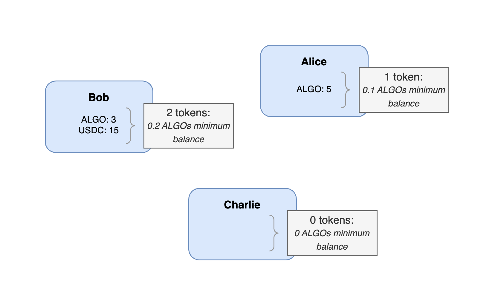
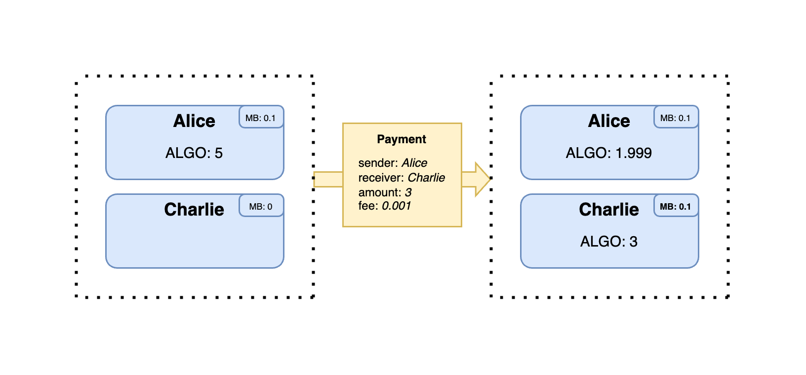
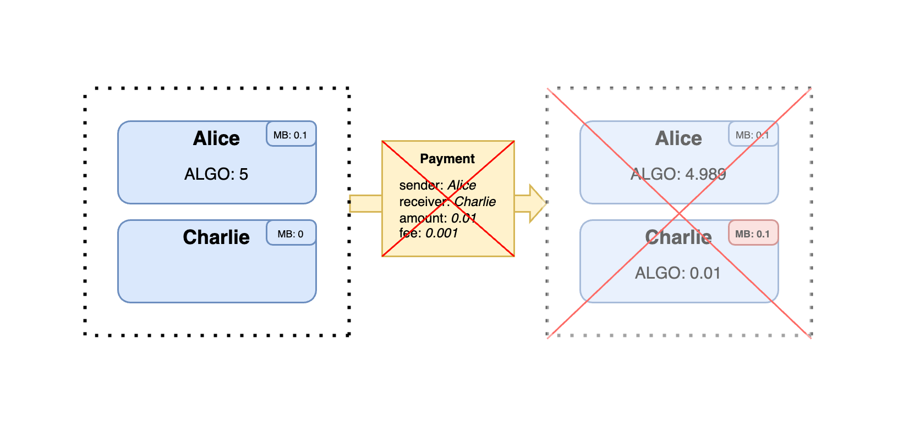
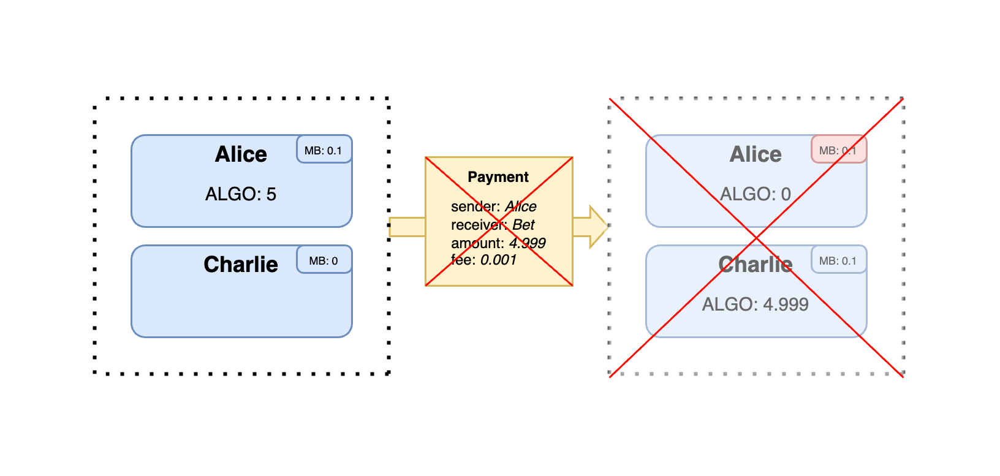
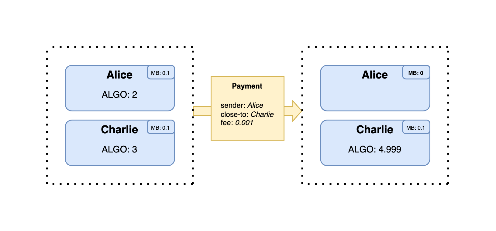
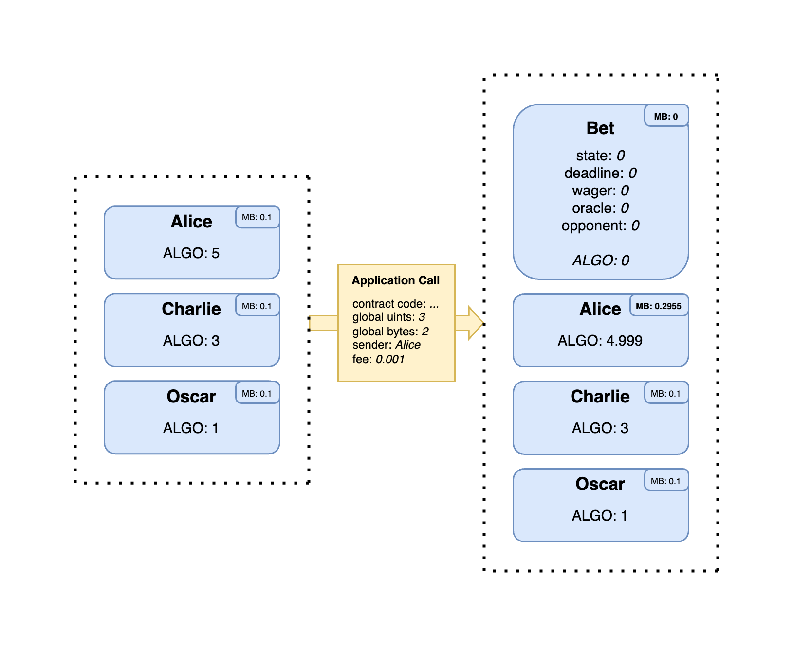
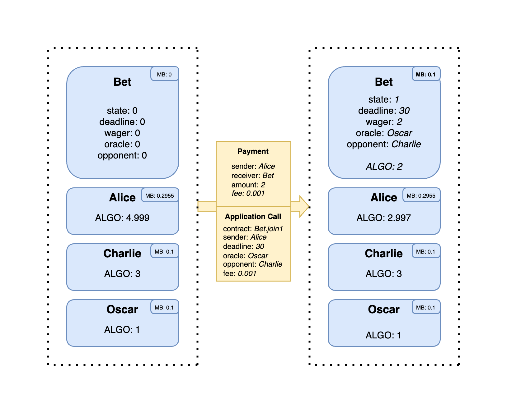
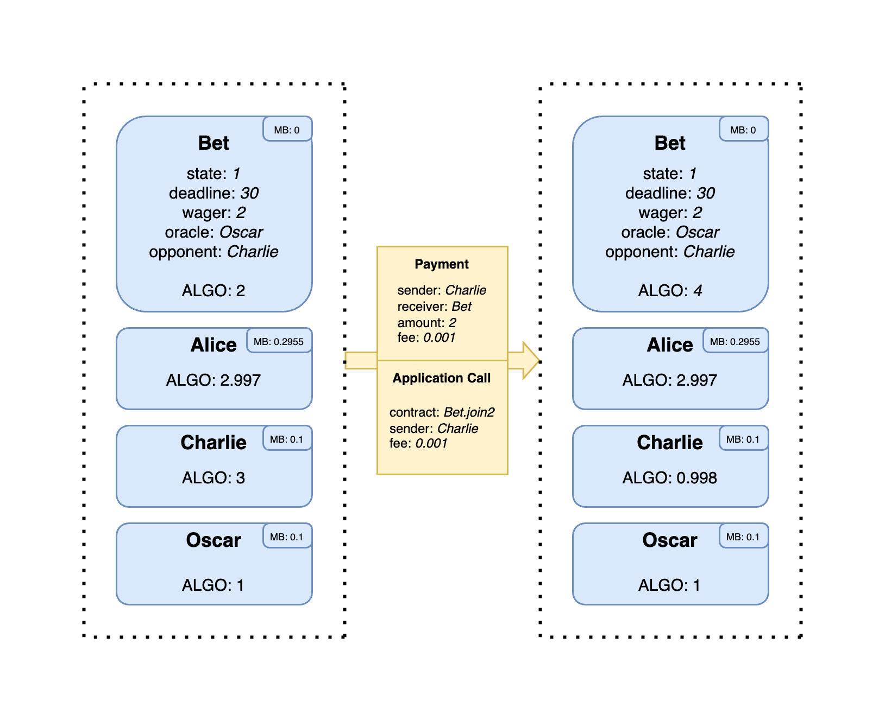
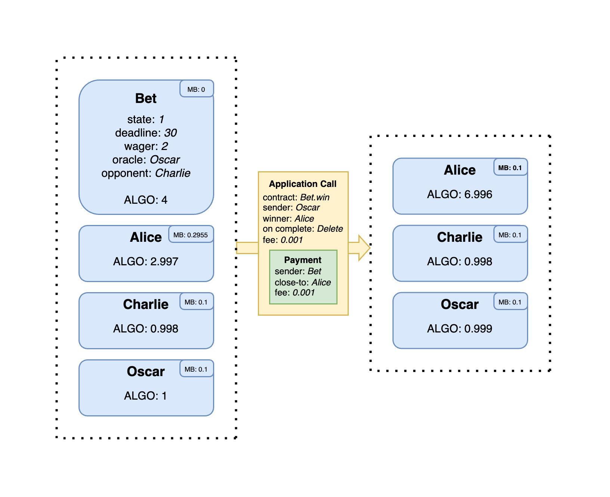
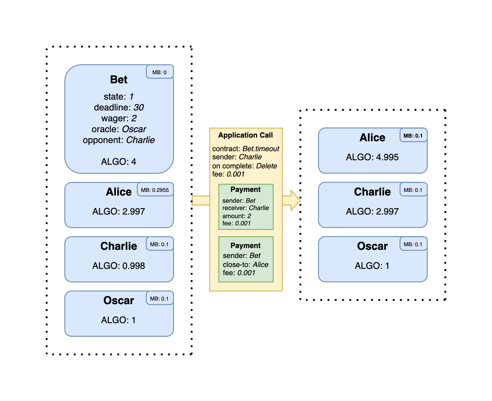

# Introduction to Algorand
Algorand is a blockchain platform launched in 2019, which over the years has updated its smart contract capabilities several times, passing from a simple model of stateless contracts to Turing-powerful stateful contracts. 

In Algorand every account (both user and contract) can hold a balance of the native cryptocurrency and of custom tokens, as well as data associated to contracts. To keep the blockchain at a reasonable size, any account that is active must maintain a minimum balance of ALGOs, which scales by the amount of different types of tokens that the account holds, as well as by how much data the account must hold in association to smart contracts (and thus, depending on how much space the account occupies in the blockchain). 

To interact with the blockchain, users can submit several types of transactions to the network. One of these transaction is the [*payment transaction*](https://developer.algorand.org/docs/get-details/transactions/transactions/#payment-transaction), which allows users to transfer ALGOs from one account to another. Each payment transaction contains information such as the `sender` (who is sending the funds), the `receiver` (who is receiving them), the `amount` (how many funds are being sent) and the fee (how many funds are being spent to execute the transaction, usually 0.001 ALGOs). 

If a transaction were to transition the blockchain into a state in which a minimum balance constraint is not satisfied, that transaction is *not* added to the chain, and no fee is paid. 

The above is true also in the case in which an account wants to move all of its ALGOs to another account, as an account with 0 ALGOs is still considered to hold ALGOs.

To make it possible to completely empty an account, it is possible to additionally specify the `close_remainder_to` field of a payment transaction, which specifies to which account the remaining funds must be sent to, making it possible to completely remove ALGOs from an account.

Other types of transactions are present, such as [*asset transfer transactions*](https://developer.algorand.org/docs/get-details/transactions/transactions/#asset-transfer-transaction), which work similarly to payment transactions, but allow users to transfer custom tokens, and [*application calls*](https://developer.algorand.org/docs/get-details/transactions/transactions/#application-call-transaction), which allows users to interact with smart contracts by providing their id, and any additional data required by the contract.

To make it possible for multiple actions to happen at the same time, multiple transactions can be put into an [atomic group of transactions](https://developer.algorand.org/docs/get-details/atomic_transfers/). If any transaction in the group fails, all transactions in the group are reverted, and no fee is paid. This makes it possible for smart contracts to require payments, while making sure that if a contract call fails, the funds are not actually sent.

We will take a look at how a simple bet contract can be implemented in Algorand, using PuyaPy.
# Core Logic
In PuyaPy, we can describe a contract as a class composed of a series of methods, each representing a different action that the contract can take. For this bet contract, we define a **join1** and **join2** method, which will be used by the two players to join the bet, a **timeout** function that can be used to return the funds in case the bet never starts, and a **win** function to declare the winner of the bet and send the funds to the winner. Each of these functions will take a series of input parameters from the call, and execute the body.
```python
class Bet(ARC4Contract):
	...
	
    @arc4.abimethod
    def join1(self, ...) -> None:
		...

    @arc4.abimethod
    def join2(self, ...) -> None:
		...

    @arc4.abimethod(...)
    def timeout(self) -> None:
		...

    @arc4.abimethod(...)
    def win(self, ...) -> None:
        ...
```
# State and contract creation
We begin the description of the contract by specifying its state. 
```python
class Bet(ARC4Contract):
    state: UInt64
    deadline: UInt64
    wager: UInt64
    oracle: Account
    opponent: Account
```
We store a `state` integer, which will encode which actions have been taken by the contract, as well as a series of settings for the bet which will be decided by the creator of the contract.

Any contract written in PuyaPy, even if it contains no functions, can be deployed by submitting a special version of the [*application call transaction*](https://developer.algorand.org/docs/get-details/transactions/transactions/#application-call-transaction), which contains the code of the program as well as how much space should be allocated for its state. When the contract is created, the creator's minimum balance will increase, as they have to allocate space for the contract's state.

# Join
We split the functionality used to join the bet into two functions, a `join1` function that can be used by the creator of the contract, and a `join2` function that can be used by their opponent.
##### Join 1
```python
@arc4.abimethod
def join1(self, deadline: UInt64, oracle: Account, opponent: Account, txn: gtxn.PaymentTransaction) -> None:
	assert self.state == UInt64(0) # CREATED
	assert txn.sender == Global.creator_address
	assert txn.receiver == Global.current_application_address
	
	self.oracle = oracle
	self.deadline = deadline
	self.opponent = opponent
	self.wager = txn.amount

	self.state = UInt64(1) # JOINED1
```
To call the `join1` function we require three parameters to be passed to the contract: 
* `deadline`, an integer representing the amount of time that can elapse between this action and the timeout;
* `oracle`, the address of the account who will decide the winner; and
* `opponent`, the address of the account that the creator of the contract will play against.
Additionally, the contract takes an extra parameter `txn`, indicating that some payment must be atomically grouped together with the application call.

At the beginning of the body, we pose three additional constraints that must be satisfied for the function to be successfully called:
* `assert self.state == UInt64(0)`: the function can only be called when the contract is in state 0 (the original value of the state variable when the contract is created), this value will change after `join1` is called, making it so that it can only be called once, after creation.
* `assert txn.sender == Global.creator_address`: the function can only be called if the funds in the payment transaction `txn` are sent by the creator of the contract
* `assert txn.receiver == Global.current_application_address`: that same transaction `txn` must have as the receiver of the funds the contract itself.
Importantly, note that if one of these assert fails, the whole group of transactions will be reverted, including the payment `txn`.

The contract will then initialize the three fields `oracle`, `deadline` and `opponent` with the provided parameters, and the `wager` field with the amount of algos transferred by the `txn` payment transaction. Lastly, we signal that the first player has joined, by setting `state` to `1`.

Interestingly, note that because of the minimum balance constraints, not all payment transactions to the contract will be valid. In fact, with how we're writing the contract, it will only be possible to make wagers of at least 0.1 ALGOs, as any smaller amount would lead to the contract account not reaching the minimum balance. The contract can be adapted to require this 0.1 ALGOs is sent as an additional amount that will be sent back to the creator of the contract, no matter who wins.

##### Join 2
```python
@arc4.abimethod
def join2(self, txn: gtxn.PaymentTransaction) -> None:
	assert self.state == UInt64(1) # JOINED1
	assert txn.sender == self.opponent
	assert txn.receiver == Global.current_application_address
	assert txn.amount == self.wager
	  
	self.state = UInt64(2) # JOINED2
```
Similarly, to call `join2`, we require a payment transaction from the opponent to the contract. This time we constrain the amount sent in the payment transaction to be equal to `wager`, i.e. the amount sent by the first player in `join1`.

# Win
```python
@arc4.abimethod(allow_actions=["DeleteApplication"])
def win(self, winner: Account) -> None:
	assert self.state == UInt64(2) # JOINED2
	assert winner == self.opponent or winner == Global.creator_address
	assert Txn.sender == self.oracle
	itxn.Payment(
		receiver=winner,
		close_remainder_to=winner,
	).submit()
```
After both players have joined the bet, the `oracle` will be able to call the `win` function, and declare as the `winner` either the *creator* of the contract (player 1) or its `opponent` (player 2). 

At the beginning of the method (`allow_actions=["DeleteApplication"]`) we specify that the `win` function can only be called if the caller *requests the contract to be deleted*, making sure that if this function is called, the memory allocated by the contract will be freed, releasing a part of the minimum balance constraint from the contract's creator. In Algorand, in fact, the contract cannot choose to delete itself with a special command, but can only check if the caller is trying to delete the contract (making it possible to only allow it under certain circumstances, or requiring it in other). In PuyaPy, one has to explicitly declare which actions can be taken when a function is called. By default, the only allowed action is `NoOp`, that is, no action is taken. Other possible [actions](https://developer.algorand.org/docs/get-details/dapps/avm/teal/specification/#oncomplete) include updating the contract's code and more.

When the `win` function is called, the contract itself will submit a payment transaction: all funds owned by the contract are sent to the winner. Transactions submitted by an application call are called [inner transactions](https://developer.algorand.org/docs/get-details/dapps/smart-contracts/apps/innertx/) and its fees are paid by the contract's account, unless otherwise specified.

# Timeout
```python
@arc4.abimethod(allow_actions=["DeleteApplication"])
def timeout(self) -> None:
	assert Global.round > self.deadline
	if self.state == UInt64(2): # JOINED2
		itxn.Payment(
			receiver=self.opponent,
			amount=self.wager,
			fee=0,
		).submit()
	itxn.Payment(
		receiver=Global.creator_address,
		close_remainder_to=Global.creator_address,
		fee=0,
	).submit()
```
If one of the two players don't join, or if the oracle doesn't make a decision in time, the `timeout` function will be callable by anyone. When this function is called all funds are given back to the original parties: if both have joined, the contract sends back the wager to player 2, and the rest of the funds to player 1. Otherwise (if player 2 has not joined), the contract sends all funds to player 1. Similarly to the `win` function, the `timeout` function can also only be called if the application call deletes the contract.

