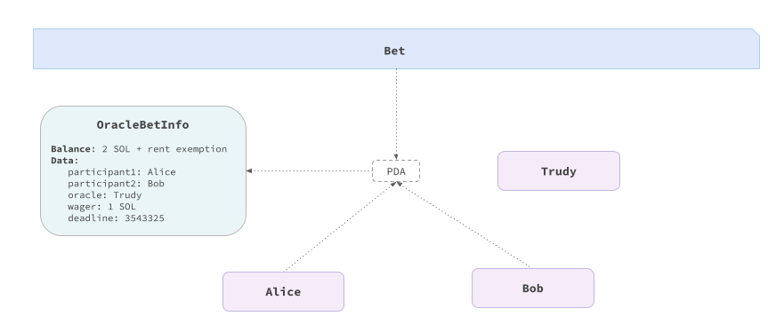

# Bet Contract in Anchor

This is an implementation of the contract in [Anchor](https://www.anchor-lang.com), a [Rust](https://www.rust-lang.org)-based framework for Solana smart contracts. The purpose of this document is to simplify the understanding of the code by providing a high-level overview of the implementation. We'll omit some implementation details, such as crate imports and error definitions, for brevity.

⚠️ Prerequisites: Prior knowledge of [Anchor](https://www.anchor-lang.com) and familiarity with concepts such as [Solana stateless account model](https://solanacookbook.com/core-concepts/accounts.html#facts), [rent exemption](https://solanacookbook.com/core-concepts/accounts.html#rent), and [Program Derived Addresses (PDA)](https://solanacookbook.com/core-concepts/pdas.html#facts) are recommended for a complete understanding.

## Specification

The use case involves two players and an oracle. The players join the contract by depositing 1 SOL each and setting the deadline. The oracle is expected to determine the winner between the two players. The winner can redeem the whole pot. If the oracle does not choose the winner by the deadline, then both players can redeem their bets.

⚠️ Note: For detailed specification and possible deviations, please refer to the [specification](../../README.md).

## Core Logic

First, let's draft the main contract logic. Later on, we will fill it with more details and explanations.

There are three available actions: `join`, `win`, and `timeout`. As the contract progresses through these steps, we need a location to keep the bet details: who the participants are, the wager, and the deadline. This is where the stateful approaches for Solidity and Ethereum start to differ the most, since in the latter case, the data is stored directly within the contract.
Solana contracts, on the other hand, only contain executive logic. The necessary data is stored in additional accounts that are supplied as input.
In reference to our contract, as can be seen below, we establish a `BetInfo` data structure that defines the information that an account will contain for the bet.

In Anchor, all accounts involved in an action are provided through a context, which is an array of accounts with various constraints applied to them. Accounts associated with the `join` action, for instance, are included in the `JoinCtx` context. In addition to the account context, we can pass additional parameters, such as the `delay` in the `join` action, to calculate the deadline.

With this knowledge in mind, the following Rust code snippet demonstrates the core contract logic:

```rust
#[program]
pub mod bet {
    use super::*;

    pub fn join(ctx: Context<JoinCtx>, delay: u64, wager: u64) -> Result<()> {
        // Bet logic:
        // - Initialize a bet account
        // - Transfer of the wager from the participants to the bet account
    }

    pub fn win(ctx: Context<WinCtx>) -> Result<()> {
        // Win logic:
        // - Transfer the balance of the bet account to the winner
    }

    pub fn timeout(ctx: Context<TimeoutCtx>) -> Result<()> {
        // Timeout logic:
        // - Refund the participants
    }
}

#[account]
#[derive(InitSpace)]
pub struct BetInfo {
    pub oracle: Pubkey,
    pub participant1: Pubkey,
    pub participant2: Pubkey,
    pub wager: u64,
    pub deadline: u64,
}

#[derive(Accounts)]
pub struct JoinCtx<'info> {
    // Accounts involved in the join action
}

#[derive(Accounts)]
pub struct WinCtx<'info> {
    // Accounts involved in the win action
}

#[derive(Accounts)]
pub struct TimeoutCtx<'info> {
    // Accounts involved in the timeout action
}
```

## Join Context and Logic

Once we've defined the core contract logic, let's implement the accounts context of the `join` action.

The `join` action involves two participants and the oracle. Both participants are required to join simultaneously. For this purpose, they are typed as `Signer` accounts, contrary to the oracle.

Since Solana smart contracts are [stateless]((https://solanacookbook.com/core-concepts/accounts.html#facts)), the third account is `bet_info` of type `BetInfo` with the purpose of storing information about the bet for the involved participants.
It is an account that does not yet exist and is initialized (`init` attribute) by player1 (`payer` attribute). In particular, the payer covers the [rent fees](https://solanacookbook.com/core-concepts/accounts.html#rent) for the account initialization. Every account on Solana needs to be rent-exempted, meaning that it must have a balance of at least two years' worth of rent proportional to the size of the account.
The space is calculated using the `BetInfo::INIT_SPACE` constant, with 8 bytes allocated for Anchor [discriminator](https://book.anchor-lang.com/anchor_bts/discriminator.html).

The address of `bet_info` is a special address called [PDA](https://solanacookbook.com/core-concepts/pdas.html#facts) (Program Derived Address), which are deterministically generated addresses, designed to be exclusively controlled by our contract. The `seeds` attribute is used to derive the address of the account. The seeds are used to establish a mapping between the couple (`participant1`, `participant2`) and their storage account. The consequence of this combination of seeds is that a single couple (`participant1`, `participant2`) cannot have at the same time two different bets.
We provide a graphic representation of this concept in the image below. The arrows entering the PDA rectangle represent inputs used to derive the address of the account.

The last account is the `system_program` account, a native contract required in instructions containing account initializations and asset transfers.

```rust
#[derive(Accounts)]
pub struct JoinCtx<'info> {
    #[account(mut)] // Mutable because depositing the wager
    pub participant1: Signer<'info>,

    #[account(mut)] // Mutable because depositing the wager
    pub participant2: Signer<'info>,

    pub oracle: SystemAccount<'info>,

    #[account(
        init, // The account must be initialized
        payer = participant1, // with participant1 as the payer
        seeds = [participant1.key().as_ref(), participant2.key().as_ref()], 
        bump,
        space = 8 + BetInfo::INIT_SPACE
    )]
    pub bet_info: Account<'info, BetInfo>,

    // Native Solana program required in account initializations and asset transfers 
    pub system_program: Program<'info, System>,
}
```



Once we have the context, we can implement the logic of the `join` action. The logic involves initializing the `bet_info` account with the information about the bet, and both participants transferring the same wager to the `bet_info` account. Calling the `join` action will cause an error since the `bet_info` account was already initialized.

```rust
pub fn join(ctx: Context<JoinCtx>, delay: u64, wager: u64) -> Result<()> {
    let participant1 = ctx.accounts.participant1.to_account_info();
    let participant2 = ctx.accounts.participant2.to_account_info();
    let oracle = ctx.accounts.oracle.to_account_info();
    let bet_info = &mut ctx.accounts.bet_info;

    // Initializing the bet info
    bet_info.oracle = *oracle.key;
    bet_info.participant1 = *participant1.key;
    bet_info.participant2 = *participant2.key;
    bet_info.deadline = Clock::get()?.slot + delay;
    bet_info.wager = wager;

    // Participant 1 deposits the wager
    system_program::transfer(
        CpiContext::new(
            ctx.accounts.system_program.to_account_info(),
            system_program::Transfer {
                from: participant1.clone(),
                to: bet_info.to_account_info().clone(),
            },
        ),
        bet_info.wager,
    )?;

    // Participant 2 deposits the wager
    system_program::transfer(
        CpiContext::new(
            ctx.accounts.system_program.to_account_info(),
            system_program::Transfer {
                from: participant2.clone(),
                to: bet_info.to_account_info().clone(),
            },
        ),
        bet_info.wager,
    )?;

    Ok(()) // Execution completed successfully without errors
}
```

## Win Context and Logic

The `win` context involves the oracle and the winner. The oracle is constrained to sign the transaction to avoid the [Missing signer check vulnerability](https://neodyme.io/en/blog/solana_common_pitfalls/#missing-signer-check). The winner is constrained to be one of the players in the bet. The storage account `bet_info` is retrieved via the same seeds used in the `join` action.

```rust
#[derive(Accounts)]
pub struct WinCtx<'info> {
    #[account(mut)]
    pub oracle: Signer<'info>, // Signer to prevent unauthorized calls, only the oracle can invoke this action

    #[account(
        mut, 
        constraint =  *winner.key == bet_info.participant1 || *winner.key == bet_info.participant2 @ Error::InvalidParticipant
    )]
    pub winner: SystemAccount<'info>,

    #[account(
        mut, 
        has_one = oracle @ Error::InvalidOracle, // The provided oracle must match the oracle_bet_info.oracle
        seeds = [participant1.key().as_ref(), participant2.key().as_ref()], 
        bump,
    )]
    pub bet_info: Account<'info, BetInfo>,

    pub participant1: SystemAccount<'info>,

    pub participant2: SystemAccount<'info>,

    pub system_program: Program<'info, System>,
}
```

The logic of the `win` action involves transferring the balance of the `bet_info` account to the winner.

In the `join` action, we were constrained to invoke the system program to transfer the assets. This is because the assets were provided by the participants, whose accounts are [owned](https://solanacookbook.com/core-concepts/accounts.html#account-model) by the system program. In the `win` action, the assets are transferred to the winner from a PDA account which is owned by the contract itself. This is why we can directly manipulate the assets in the PDA account.

```rust
pub fn win(ctx: Context<WinCtx>) -> Result<()> {
    let bet_info = ctx.accounts.bet_info.to_account_info();
    let winner = ctx.accounts.winner.to_account_info();

    // The winner receives the whole pot using try_borrow_mut_lamports 
    // to borrow and mutate the lamports (the base unit of currency in Solana)
    **winner.try_borrow_mut_lamports()? += bet_info.to_account_info().lamports();
    **bet_info.try_borrow_mut_lamports()? = 0;

    Ok(()) // Execution completed successfully without errors
}
```

## Timeout Context and Logic

In the `timeout` action, besides the correctness of the addresses of the participants, we do not require any signature. The `bet_info` account is retrieved with the same seeds used in the `join` action.

```rust
#[derive(Accounts)]
pub struct TimeoutCtx<'info> {
    #[account(mut)]
    pub participant1: SystemAccount<'info>,

    #[account(mut)]
    pub participant2: SystemAccount<'info>,

    #[account(
        mut,
        seeds = [participant1.key().as_ref(), participant2.key().as_ref()], 
        bump,
    )]
    pub bet_info: Account<'info, BetInfo>,

    pub system_program: Program<'info, System>,
}
```

The logic of the `timeout` action involves refunding the participants with the wager and the participant1 also with the remaining lamports designed for the rent exemption, since it was the initializer of the `bet_info` account. The deadline is checked against the current slot; if the deadline is not reached, the transaction is aborted.

```rust
pub fn timeout(ctx: Context<TimeoutCtx>) -> Result<()> {
    let bet_info = &mut ctx.accounts.bet_info;
    let participant1 = ctx.accounts.participant1.to_account_info();
    let participant2 = ctx.accounts.participant2.to_account_info();

    // The deadline must be reached
    require!(bet_info.deadline < Clock::get()?.slot, Error::DeadlineNotReached);

    // Refund participant2 with the wager
    **participant2.try_borrow_mut_lamports()? += bet_info.wager;
    **bet_info
        .to_account_info()
        .try_borrow_mut_lamports()? -= bet_info.wager;

    // Refund participant1 with the wager + the bet_info rent exemption 
    // since it' was created by participant1 in the join action
    **participant1.try_borrow_mut_lamports()? += bet_info.to_account_info().lamports();
    **bet_info
        .to_account_info()
        .try_borrow_mut_lamports()? = 0;

    Ok(()) // Execution completed successfully without errors
}
```
