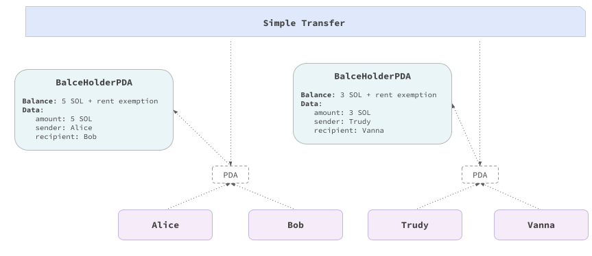

# Simple Transfer Contract in Anchor

This is an implementation of the contract in [Anchor](https://www.anchor-lang.com), a [Rust](https://www.rust-lang.org)-based framework for Solana smart contracts. The purpose of this document is to simplify the understanding of the code by providing a high-level overview of the implementation.

The full specification and possible deviations from it are described in the [specification](../../README.md). Here we describe the implementation details.

⚠️ A deeper dive into Anchor is advised by reading the [Anchor documentation](https://www.anchor-lang.com). Additionally, understanding concepts such as 
- [Solana stateless account model](https://solanacookbook.com/core-concepts/accounts.html#facts)
- [Rent exemption](https://solanacookbook.com/core-concepts/accounts.html#rent)
- [Program Derived Addresses (PDA)](https://solanacookbook.com/core-concepts/pdas.html#facts)

is recommended for a complete understanding.


### Main Logic

The use case allows a `donor` to deposit native cryptocurrency, and a `receiver` to withdraw arbitrary fractions of the contract balance. We'll omit some implementation details, such as crate imports and error definitions, for brevity.

Let's start by crafting the main contract logic. We have two actions: `deposit` and `withdraw`, each with its own context of associated accounts and parameters. We also define the account structure `BalanceHolderPDA`, which holds the donated balance and associated actors.


```rust
pub mod simple_transfer {

    pub fn deposit(ctx: Context<DepositCtx>, amount_to_deposit: u64) -> Result<()> {
        // Deposit logic
    }

    pub fn withdraw(ctx: Context<WithdrawCtx>, amount_to_withdraw: u64) -> Result<()> {
        // Withdraw logic
    }
}

#[derive(Accounts)]
pub struct DepositCtx<'info> {
    // Accounts involved in the deposit action
}

#[derive(Accounts)]
pub struct WithdrawCtx<'info> {
    // Withdraw accounts
    // Accounts involved in the withdraw action
}

#[account]
#[derive(InitSpace)] // To automatically derive the space required for the account
pub struct BalanceHolderPDA {
    pub sender: Pubkey,
    pub recipient: Pubkey,
    pub amount: u64
}
```

### Deposit Context and Logic
Once we've defined the main logic, let's implement the accounts context of the deposit action.

The first two accounts are the `sender` and `recipient` accounts. The sender is required to sign the transaction (`Signer` type). 

Since solana smart contracts are [stateless]((https://solanacookbook.com/core-concepts/accounts.html#facts)), the third account is the `balance_holder_pda`, a [PDA](https://solanacookbook.com/core-concepts/pdas.html#facts) account with the associated type `BalanceHolderPDA`, that will hold information such as the deposited balance and the actors. The account is initialized with the `init` attribute with `sender` as the payer. The address of this account is derived through seeds in a way to establish a mapping between the couple (`sender`, `recipient`) and their storage account. The space is calculated using the `BalanceHolderPDA::INIT_SPACE` constant to cover the [Rent exemption](https://solanacookbook.com/core-concepts/accounts.html#rent) with 8 bytes allocated for Anchor [discriminator](https://book.anchor-lang.com/anchor_bts/discriminator.html). 


The last account is the `system_program` account, a native contract, required in instructions containing account initializations.

```rust
#[derive(Accounts)]
pub struct DepositCtx<'info> {
    #[account(mut)]
    pub sender: Signer<'info>,
    pub recipient: SystemAccount<'info>,
    #[account(
        init, 
        payer = sender, 
        seeds = [recipient.key().as_ref(), sender.key().as_ref()],
        bump,
        space = 8 + BalanceHolderPDA::INIT_SPACE
    )]
    pub balance_holder_pda: Account<'info, BalanceHolderPDA>,
    pub system_program: Program<'info, System>,
}
```




Once we have the context, we can implement the deposit logic that requires the amount to be deposited to be greater than zero. Then, a transfer instruction is used to transfer the amount from the sender to the balance holder PDA. Finally, the balance holder PDA account data is set.

```rust
pub fn deposit(ctx: Context<DepositCtx>, amount_to_deposit: u64) -> Result<()> {
    require!(amount_to_deposit > 0, CustomError::InvalidAmount);

    let transfer_instruction = anchor_lang::solana_program::system_instruction::transfer(
        &ctx.accounts.sender.key(),
        &ctx.accounts.balance_holder_pda.key(),
        amount_to_deposit,
    );

    // Transferring amount_to_deposit lamports from the sender to the balance holder PDA
    anchor_lang::solana_program::program::invoke(
        &transfer_instruction,
        &[
            ctx.accounts.sender.to_account_info(),
            ctx.accounts.balance_holder_pda.to_account_info(),
        ],
    )
    .unwrap();

    // Setting the balance holder PDA account data
    let balance_holder_pda = &mut ctx.accounts.balance_holder_pda;
    balance_holder_pda.sender = ctx.accounts.sender.key();
    balance_holder_pda.recipient = ctx.accounts.recipient.key();
    balance_holder_pda.amount = amount_to_deposit;

    Ok(())
}
```

### Withdraw Context and Logic

The `WithdrawCtx` context is similar to the `DepositCtx` context. The only difference is that the `recipient` account is a `Signer` type, to avoid the [Missing signer check vulnerability](https://neodyme.io/en/blog/solana_common_pitfalls/#missing-signer-check), as the recipient is the one who can withdraw the balance.


```rust
#[derive(Accounts)]
pub struct WithdrawCtx<'info> {
    #[account(mut)]
    pub recipient: Signer<'info>,
    #[account(mut)]
    pub sender: SystemAccount<'info>,
    #[account(
        mut, 
        seeds = [recipient.key().as_ref(), sender.key().as_ref()],
        bump,
    )]
    pub balance_holder_pda: Account<'info, BalanceHolderPDA>,
    pub rent: Sysvar<'info, Rent>,
}
```

In the withdraw logic, we require the amount to withdraw to be greater than zero. We then decrement the assets stored in the balance holder PDA account and increment the balance of the recipient's account. If all the donated assets have been withdrawn, we close the balance holder PDA account by transferring the remaining balance, designated for rent exemption to the account initializer, the `sender`.

ℹ️ In the `deposit` action we were constrained to invoke the system program to transfer the assets. This because the assets were provided by the sender, an account [owned](https://solanacookbook.com/core-concepts/accounts.html#account-model) by the system program. In the `withdraw` action, the assets are transferred to the recipient from a PDA account, which is owned by the program itself. This is why we can directly manipulate the assets in the PDA account.

```rust
 pub fn withdraw(ctx: Context<WithdrawCtx>, amount_to_withdraw: u64) -> Result<()> {
        require!(amount_to_withdraw > 0, CustomError::InvalidAmount);

        let from = ctx.accounts.balance_holder_pda.to_account_info();
        let to = ctx.accounts.recipient.to_account_info();

        **from.try_borrow_mut_lamports()? -= amount_to_withdraw;
        **to.try_borrow_mut_lamports()? += amount_to_withdraw;

        ctx.accounts.balance_holder_pda.amount -= amount_to_withdraw;

        let remain_lamports = **from.try_borrow_mut_lamports()?;
        if ctx.accounts.balance_holder_pda.amount == 0 {
            // All the lamports have been withdrawn, closing the lamports holder account account
            **from.try_borrow_mut_lamports()? = 0;
            **ctx.accounts.sender.to_account_info().try_borrow_mut_lamports()? += remain_lamports;
        }

        Ok(())
    }
```